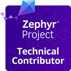
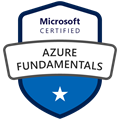
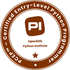

## Hi there, I'm Jerónimo Agulló 👋

## 🎓 Certifications

## Embedded Systems Developer 💻🔌

I'm a passionate embedded developer with experience in:
- Microcontroller programming (STM32, Nordic, ESP32, Arduino)
- RTOS (FreeRTOS, Zephyr)
- Low-level communication protocols (I2C, SPI, UART, CAN)
- Cloud (Azure) and IoT protocols (mqtt, LTE, Coap, etc.)
- Computer Vision (traditional algorithms, YOLO and other CNNs)
- Linux administrator

## GitHub Statistics 📊

## Skills 🛠️

<!--
**jeronimoagullo/jeronimoagullo** is a ✨ _special_ ✨ repository because its `README.md` (this file) appears on your GitHub profile.

Here are some ideas to get you started:

- 🔭 I’m currently working on ...
- 🌱 I’m currently learning ...
- 👯 I’m looking to collaborate on ...
- 🤔 I’m looking for help with ...
- 💬 Ask me about ...
- 📫 How to reach me: ...
- 😄 Pronouns: ...
- ⚡ Fun fact: ...
-->
